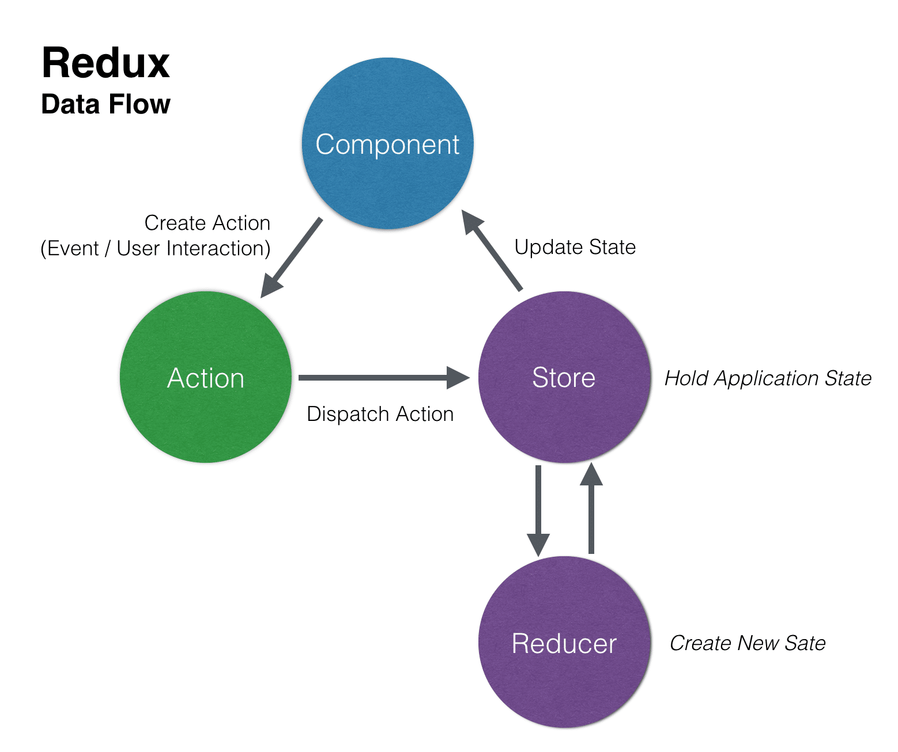
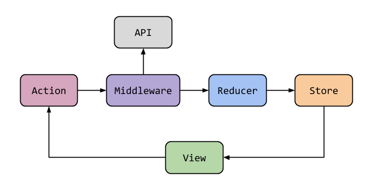
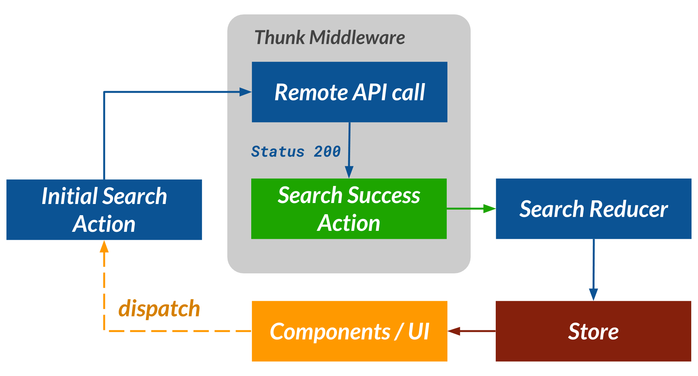
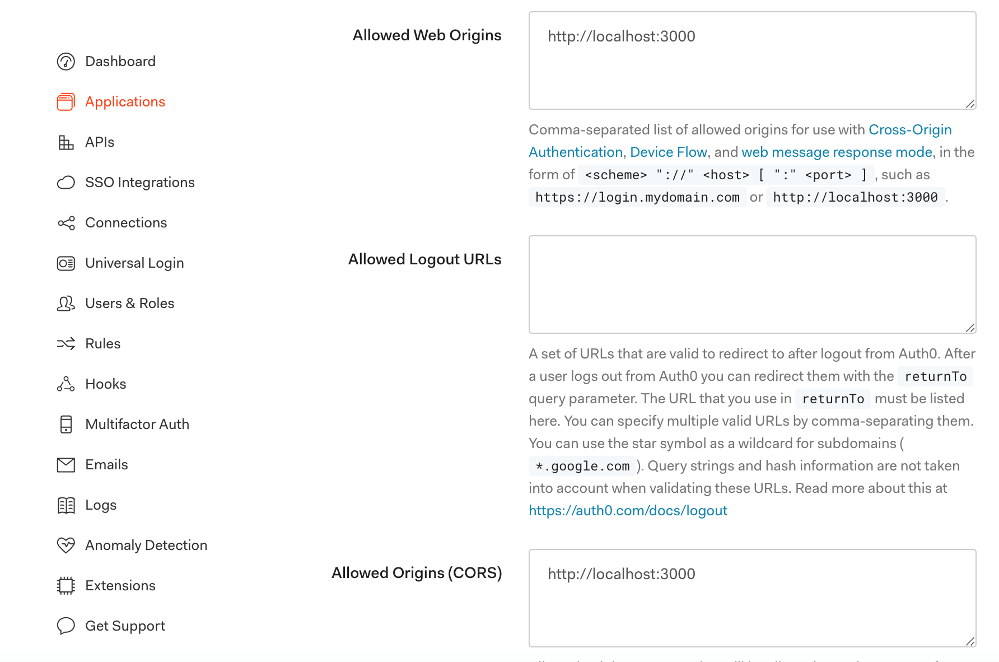
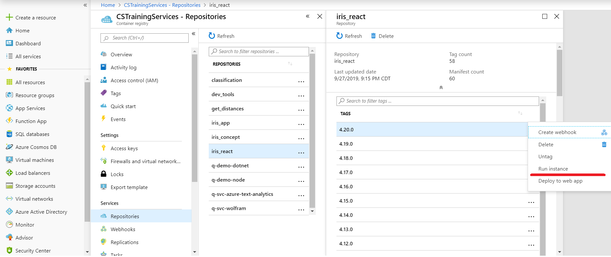
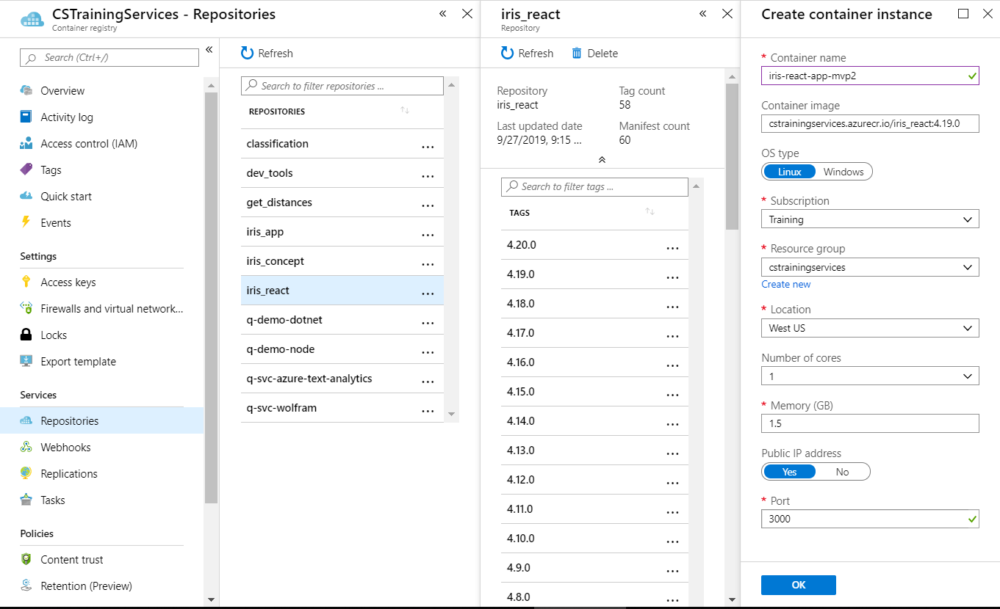
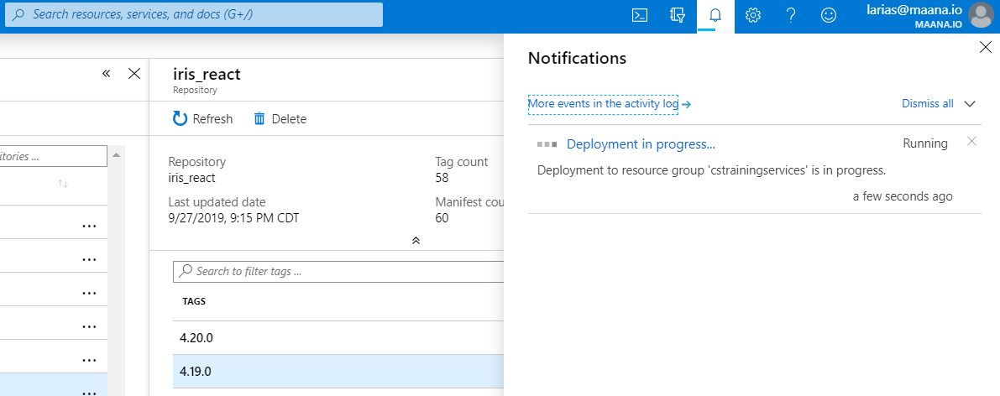
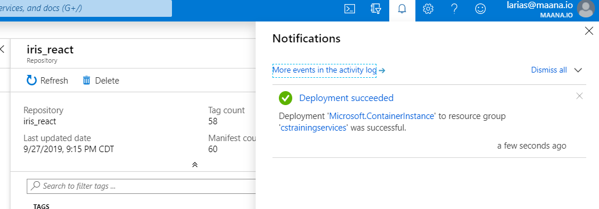
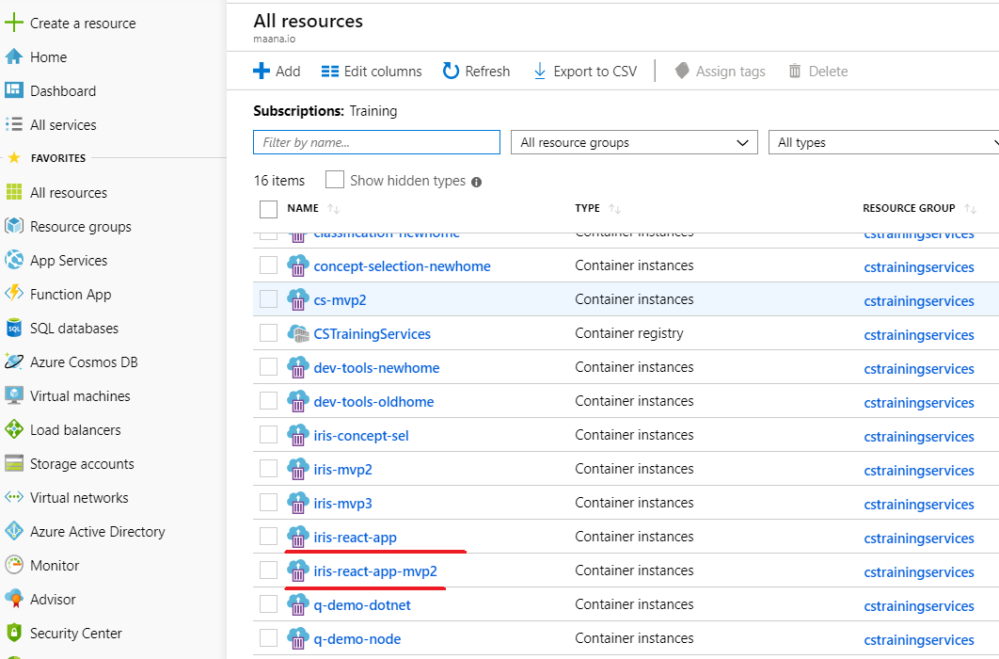
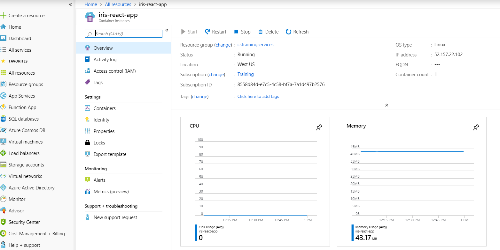

This project was bootstrapped with [Create React App](https://github.com/facebookincubator/create-react-app).

## Table of Contents

* [Architecture](#architecture)
* [Authentication](#authentication)
* [Dockerfile](#dockerfile)
* [Deployment](#deployment)

## Architecture

### Redux 

This project is managing the local state of the application with Redux, for every drawn component in the application, there is a container, action(s) and reducer(s). Every event triggered by the user can affect an unique "source of truth" which is a "tree" or a state keeper defined by reducers.

Event triggered -> Component -> Container -> Action -> Reducer -> Container -> Component with new data



More information about Redux:

[React-Redux Flow, Terminologies, and Example](https://dev.to/bouhm/react-redux-flow-terminologies-and-example-104b)

### Redux Thunk 

Redux thunk adds a middleware between dispatch actions and reducers in order to delay the normal execution of redux flow, the middleware usually calls an external API to complement the actions information. For the case of this project, the thunk executes the graphql queries and completes the action data with the given response.  





More information about Redux Thunk: 
[Redux Thunk](https://github.com/reduxjs/redux-thunk)

### Apollo & GraphQL

In order to use Apollo with Redux, the project use the Apollo stand allone client, in this way we can execute the GraphQL queries through Redux Thunk Middlewares.

## Authentication

The authentication is implemented with [Auth0 Lock Library](https://auth0.com/docs/libraries/lock/v11).  To connect to a Maana endpoint you have to add authentication setup by environment variables.

The environment variables values related to authentication can be found in the configuration panel of the auth0 tenant service application, the following environment variables are related to auth0 and have to be added to .env file or Dockerfile at the root of this folder (ui root):

* **The client ID listed in Auth0 for your Application**
REACT_APP_AUTH_CLIENT_ID=[32 char hash]

* **The domain listed in Auth0 for your Application**
REACT_APP_AUTH_DOMAIN=[auth0 tenant].auth0.com

* **The identifier listed in Auth0 for your API**
REACT_APP_AUTH_AUDIENCE=[audience url]

### Getting images from the back-end server.

In case you need to get an image from the server, you have to send the authentication headers and make the request as an XHR request, otherwise the server will response with a 401 error due the lack of authentication headers.

An example on how to get and parse the image is shown in the src/components/Concept.js file:

```
   arrayBufferToBase64(buffer) {
        var binary = '';
        var bytes = [].slice.call(new Uint8Array(buffer));
        
        bytes.forEach((b) => binary += String.fromCharCode(b));
        
        return window.btoa(binary);
    };

    getImage(conceptDiagramUrl){
        let url = conceptDiagramUrl;
        let options = {
        method: 'GET',
        headers: new Headers(this.props.authHeaders),
        mode: 'cors',
        cache: 'default'
        };
        let request = new Request(url);

        fetch(request, options).then((response) => {
            response.arrayBuffer().then((buffer) => {
                this.setState({imgSrc: 'data:image/jpeg;base64,' + this.arrayBufferToBase64(buffer)});
            });
        });
    }
```

### Important notes about Auth0 control panel configuration.

Since the UI can work with a different domain, we have to ensure Auth0 service application tenant have enabled access via CORS, ensure along help desk team that the following Auth0 configurations are properly filled with the UI domain and protocol used to display the application:

*Supposing you want to login in your local environment using port 3000 you have to add the following values:*


*In case you want to login using a different ip, like the ip of the container, you have to add that ip along the other ones separating them by commas (,)*

## Dockerfile

In order to create a docker container we have to define a Dockerfile at the root of the ui project.

An example of the file is as follows:

```
# base image where our app will run (a minimal linux distro)
FROM node:12.2.0-alpine

# set working directory
WORKDIR /app

# add `/app/node_modules/.bin` to $PATH
ENV PATH /app/node_modules/.bin:$PATH
# Auth0 env variables
ENV REACT_APP_AUTH_CLIENT_ID=[32 char hash]
ENV REACT_APP_AUTH_DOMAIN=maana-sales.auth0.com
ENV REACT_APP_AUTH_AUDIENCE=https://h4.maana.io/
# defines the envrionment, it could be development or production
ENV REACT_APP_BACKEND_ENV=development

# install and cache app dependencies
# installing git, sometimes node packages use it
RUN apk add --no-cache git
COPY ./package.json /app/package.json
RUN npm install 
# we need a basic http server to serve our app
RUN npm install -g local-web-server
COPY ./ /app
# building and minifying our application removing source maps to hide a little the logic behind
RUN GENERATE_SOURCEMAP=false npm run build

# the port we want to use to serve our app
EXPOSE 3000

# start app using npm (not recommended for production purposes)
# CMD ["npm", "start"]
# executing the basic web server to serve our app
CMD ["ws", "-s", "index.html", "--directory", "./build", "-p", "3000"]
```

In order to complement Dockerfile, we define the endpoints url through .env file, in this way, if we nee to change them we will not have to rebuild the image, in terms of deployment it lasts less uploading and building.

```
# 2 ENDPOINTS FOR DIFFERENT PURPOSES
# risks (mvp3.1)
REACT_APP_MAANA_ENDPOINT=https://cstraining01.knowledge.maana.io:8443/service/cf8237a2-a2cc-460b-bc65-9d7b8ff13ec3/graphql
# petrotechnical (mvp4)
REACT_APP_MAANA_ENDPOINT_TECHNICAL=https://cstraining01.knowledge.maana.io:8443/service/6e1fb9ec-7e67-47d7-bef0-acef02578108/graphql

```

In case you want to debug quickly using npm instead of docker, you have to keeo a copy in .env file of the same environmnent variables defined in Dockerfile, in this way, wheter you run the app as a docker container or a npm project you will work with the same parameters.

```
REACT_APP_AUTH_CLIENT_ID=[32 char hash]
REACT_APP_AUTH_DOMAIN=maana-sales.auth0.com
REACT_APP_AUTH_AUDIENCE=https://h4.maana.io/
REACT_APP_BACKEND_ENV=development

# 2 ENDPOINTS FOR DIFFERENT PURPOSES
# risks (mvp3.1)
REACT_APP_MAANA_ENDPOINT=https://cstraining01.knowledge.maana.io:8443/service/cf8237a2-a2cc-460b-bc65-9d7b8ff13ec3/graphql
# petrotechnical (mvp4)
REACT_APP_MAANA_ENDPOINT_TECHNICAL=https://cstraining01.knowledge.maana.io:8443/service/6e1fb9ec-7e67-47d7-bef0-acef02578108/graphql

```

## Deployment

There are two ways to run the application locally:


### Running the UI locally through npm scripts:
```
\iris\ui>npm start
```

This will execute the start script pointed in packages.json.
```
 "scripts": {
    "start": "react-scripts start",
    "build": "react-scripts build",
    "test": "react-scripts test --env=jsdom",
    "eject": "react-scripts eject"
  },
```

### Runnung the UI locally using docker.

Build docer image: 
```
\iris\ui>docker build -t iris_react .
```
Once the image is buit, then you have to expose and map the port 3000 of your local machine to your container 3000 port:
```
docker run -p 3000:3000 iris_react
```

### Uploading the project to the Azure cloud

This requires "contributor" access to the target Azure Container Registry and Resource Group.

**1) First of all be sure you can log in to the azure cloud via CLI:**

```
docker login --username [USERNAME] --password [PASSWORD] [ACR_NAME].azurecr.io
```

*ACR_NAME = Azure Container Registry Name*

**2) Buid the image**

```
docker build --tag=[ACR_NAME].azurecr.io/[APP_NAME]:[VERSION] .
```
*APP_NAME = container name*
*VERSION = container version*

Example: 

```
docker build --tag=cstrainingservices.azurecr.io/iris_react:4.20.0 . 
```

**3) Push the built image to azure**

```
docker push cstrainingservices.azurecr.io/iris_react:4.20.0
```

**4) Go to azure dashboard and run instance**



Add a container name in order to identify it among others and define the port azure have to use to display the app, no other settings have to be modified, you have to finish this step clicking on ok button. 

In the example bellow, the container was identified as iris-react-app-mvp2 and port 3000 is used to display the app. 







*Note: In case you use another container name, another instance will be created with another ip, so, in order to update an existing environment, you should use the same container name. If you want to use another container with a diffrent ip, you should have to ask to help desk to provide a new auth access for that new ip/domain, otherwise you will be unable to login using auth0 credentials.*

*For this UI, we are using two containers, one stable for demo purposes (iris-react-app) and other for development (iris-react-app-mvp2)*

**5) Check the status of the container**

Going to All resources section you can see the status, health and ip of the containers. Sometimes the ip can be changed automatically by Azure due problems with the container, in that case we have to setup again the Auth0 tenant configurations with the new ip.






More information about azure and docker containers:

[MAANA.IO - .NET Core (C#) - GraphQL Service Template (Basic)](https://github.com/maana-io/q-tutorials/tree/master/claroil/well-opportunity/dotnet)# Iresh

